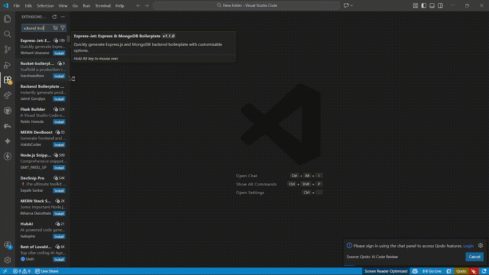

# Backend Boilerplate Generator

[Repository](https://github.com/jaimilgorajiya/backend-boilerplate-generator) | [Issues](https://github.com/jaimilgorajiya/backend-boilerplate-generator/issues) | [Changelog](https://github.com/jaimilgorajiya/backend-boilerplate-generator/blob/main/CHANGELOG.md)

> **Instantly generate clean, scalable Node.js backend CRUD boilerplates.**

---

## 📖 Overview

Backend Boilerplate Generator is a professional VS Code extension designed to streamline backend development. It allows developers to generate a production-ready **Node.js, Express, and MongoDB (Mongoose)** CRUD structure in a single command.

This tool enforces a strict, clean architecture, eliminating repetitive setup tasks and ensuring consistency across projects.

---

## 📺 Demo



> *Tip: Watch the extension in action above!*

---

## ✨ Core Features

- **One-Command Generation**: Create a full backend structure (Model, Controller, Route) instantly.
- **Multi-Entity Support**: Seamlessly add multiple entities (e.g., User, Product, Order) to the same project.
- **Clean Architecture**: Follows industry-standard separation of concerns.
- **Safe Execution**: Logic appends to existing files (like `server.js`) without overwriting custom code.
- **Strict Structure**: Generates only essential files, keeping the codebase minimal and predictable.
- **Developer Friendly**: Ideal for rapid prototyping, learning, and enterprise-grade applications.

---

## 📥 Installation

1.  Open **VS Code**.
2.  Go to the **Extensions** view (`Ctrl+Shift+X` or `Cmd+Shift+X`).
3.  Search for **Backend Boilerplate Generator**.
4.  Click **Install**.

---

## 🚀 How It Works

1.  Open the **Command Palette** (`Ctrl+Shift+P` or `Cmd+Shift+P`).
2.  Run the command **Backend Boilerplate Generator: Generate CRUD**.
3.  Enter the **Entity Name** (e.g., `Product`, `User`).
4.  Enter the **Fields** for the entity.

The extension programmatically creates the files and opens the controller for immediate editing.

---

## 📝 Usage Instructions

### Command
`Backend Boilerplate Generator: Generate CRUD`

### Inputs

1.  **Entity Name**:
    *   Input: `product`
    *   Result: Autocorrects to `Product` (PascalCase).

2.  **Fields Definition**:
    *   Format: `key:type key:type`
    *   Supported Types: `string`, `number`, `boolean`, `date`, `string[]` (arrays).

### Example Workflow (Multi-Entity)

**1. Create Product Entity**
Input: `name:string price:number isStock:boolean`
*Result: Generates Product files and creates server.js*

**2. Create User Entity**
Input: `username:string email:string roles:string[]`
*Result: Generates User files and **updates** server.js to include User routes automatically.*

---

## 🧱 Generated Structure

The extension generates a strict and clean folder structure:

```
backend/
 ├── config/
 │   └── db.js                 # Database connection logic
 ├── models/
 │   └── <Name>.Models.js      # Mongoose Schema
 ├── controllers/
 │   └── <Name>.Controller.js  # CRUD implementation
 ├── routes/
 │   └── <Name>.Routes.js      # Express Routes
 └── server.js                 # Main entry point
```

> **Note:** No unnecessary folders, configuration files, or bloat are created.

---

## 🛠️ Tech Stack

This extension generates boilerplates built on:

-   **Runtime**: Node.js
-   **Framework**: Express.js
-   **Database**: MongoDB (Mongoose ODM)
-   **Architecture**: Modular MVC

---

## 🎯 Who Is This For?

-   **Backend Developers**: Save time on repetitive setup and focus on business logic.
-   **MERN Stack Developers**: Standardize the backend structure across different projects.
-   **Interns & Beginners**: Learn best practices implementation of REST APIs.
-   **Teams**: Ensure every team member follows the same clean code structure.

---

---

## 🤝 Contributing

We welcome contributions! Please read our [Developer Guide](CONTRIBUTING.md) for details on how to set up the project locally, run tests, and submit pull requests.

---

## 👨‍💻 Author

**Jaimil Gorajiya**

-   **GitHub**: [github.com/jaimilgorajiya](https://github.com/jaimilgorajiya)
-   **LinkedIn**: [linkedin.com/in/jaimilgorajiya](https://linkedin.com/in/jaimilgorajiya)

---

## 📄 License

This project is licensed under the [MIT License](https://opensource.org/licenses/MIT).
